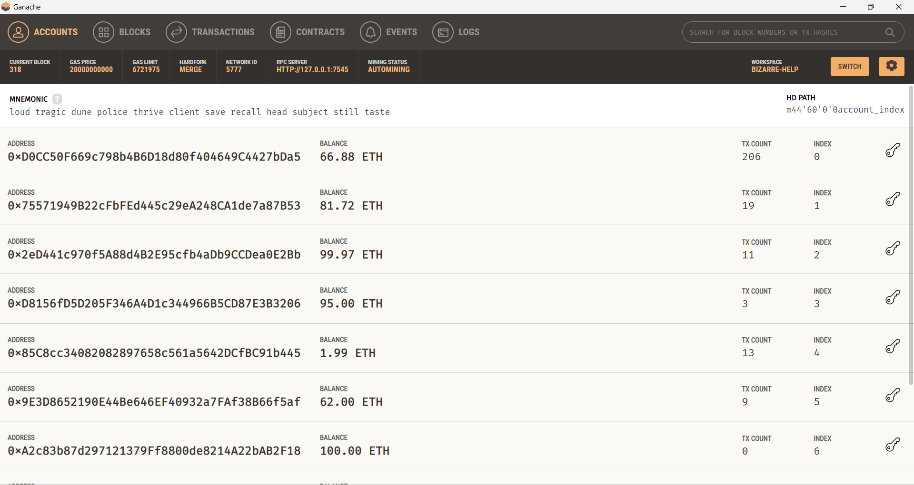
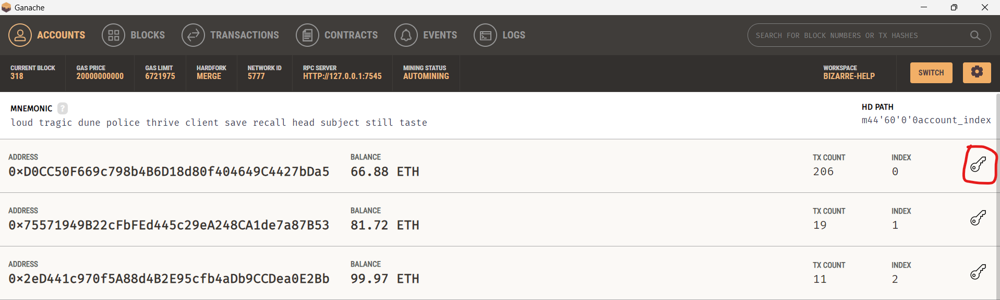
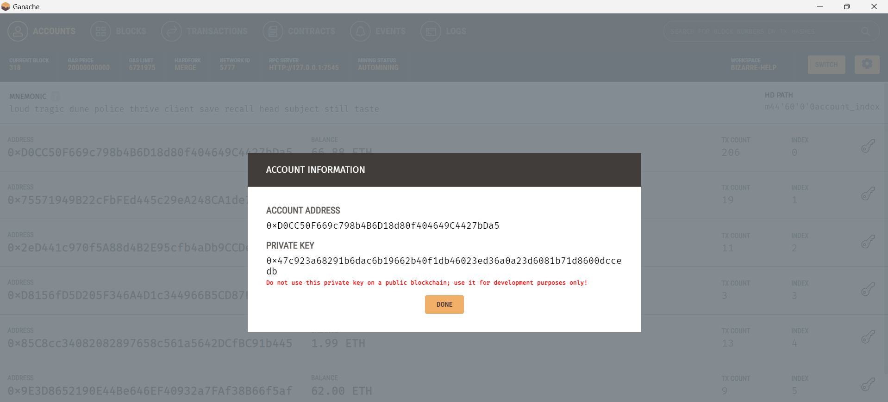
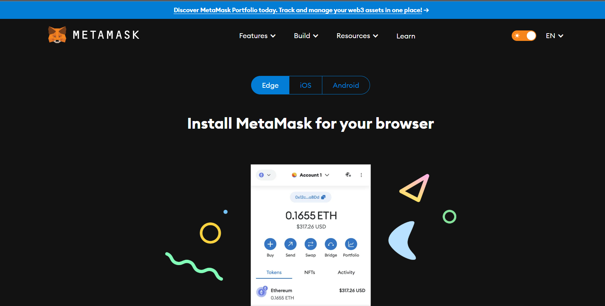

1-clone this repository
## ` git clone https://github.com/prateushsharma/iiest_prj.git `
2- download dependecies
## ` npm install `

3- Install Ganache 
## `To install Ganache- https://archive.trufflesuite.com/ganache/`

### the accounts shown in your ganache home may be different
## note the RPC SERVER ,its written at the top

## 4- Click on the key icon at right

## You can choose any account

## After step 4 you will se the private key of the account copy it 

## 5- download metamask extension - https://metamask.io/download/

