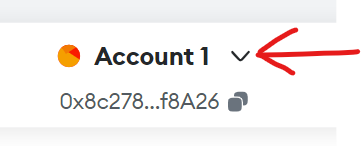
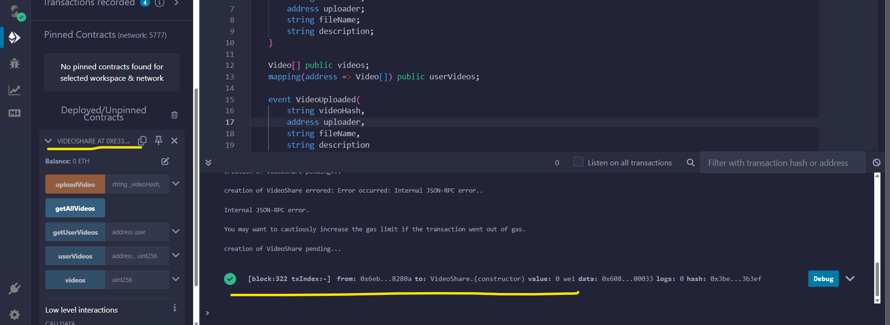

## ` follow the steps , after completing all the steps you can see you dapp running `
1-clone this repository
## ` git clone https://github.com/prateushsharma/iiest_prj.git `
2- download dependecies
## ` npm install `

3- Install Ganache 
## `To install Ganache- https://archive.trufflesuite.com/ganache/`

### the accounts shown in your ganache home may be different
## note the RPC SERVER ,its written at the top

## 4- Click on the key icon at right

## You can choose any account

## After step 4 you will see the private key of the account copy it 

## 5- download metamask extension - https://metamask.io/download/

## 6-Complete the setup

### 7- Click here to open available networks

### 8 - click on Add Network 

### 9 - Click on Add a network manually

### 10 - Add the details to connect to ganache network

### 11- click  on the dropdown button at the top 

### 12- click on the add account or hardware wallet

### 13- click import account

### 14-now paste the private key which we have copies at step 4

## -- now after importing you can see your ganache account has been added to the metamask wallet
## --following the same steps 11-14 you can add more ganache accounts in metamask wallet

## 15- go to - https://www.pinata.cloud/
 ##  create an account and login
 ## go to api keys section and create new one
 

 ## Enter key name select all and create a key
 
 

## after creating copy all the details of the key and store it some where
 

 # 16- ` go to src/components/Upload.jsx`
 ###` in line 62 and 63 replace pinata api key and pinata secret api key which you have copied at step 15`

 

 # 17 -` go to https://remix.ethereum.org/ ` now we are going to deploy the contract
 ## ` create a new work space `
 ## `in contracts folder create a new file`
 ## ` copy paste the contract- you can find contract in components/Contracts/IIEST.sol `
 ## ` compile it - note set the compiler version to 0.8.0 , after compiling copy the ABI and store it `
 

 # 18 - ` go to deploy section `
 ## ` change network to injected metamask provider `
 # ` note- if you are on any other network in metamask wallet then switch to ganache`
 
 ## ` now press deploy button `
 ## ` you will see the metamask pop up `
 ## ` press confirm to approve the transaction (deployement) `
 
 ## ` now you can see the green tick and some function of the contract `
 ## ` copy the address of the contract  and store it `
 

 ## 19 ` now go to src/componenets/ContractAddress.js  and paste the contract addres which we have just got `
 ## 20-` in step 17 after compiling we have copied the ABI now paste it src/components/ABI.json `
## 21- type ` npm run ` to start the dapp
